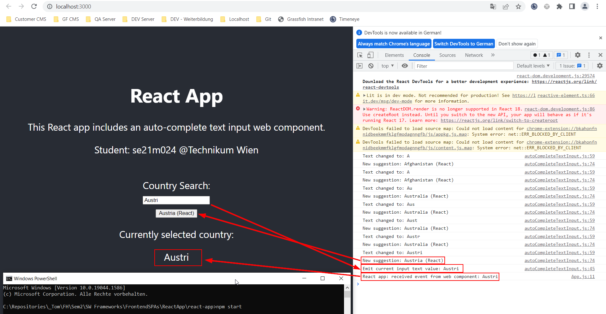
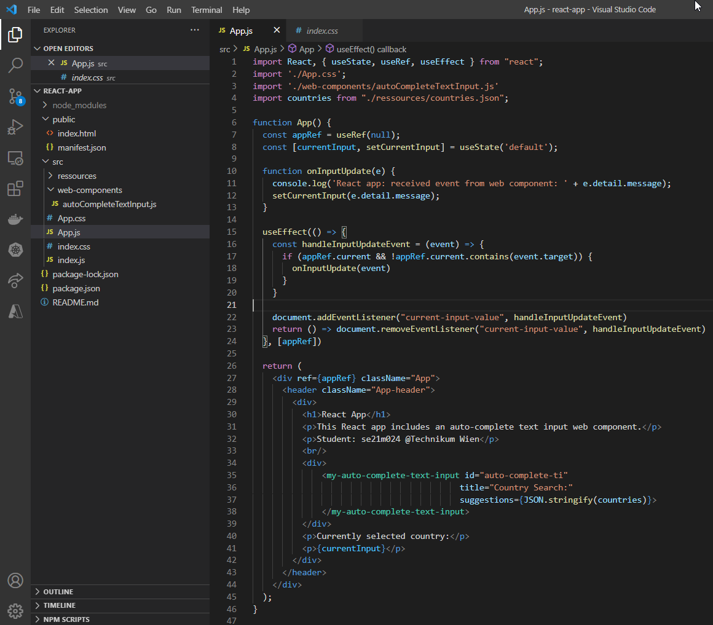

## Software Frameworks

## Assignment: Frontend

## Author: se21m024

 

# Summary

A technology agnostic web component was implemented and used within a Vue and a React web app.

# Repository

Please clone the following repository:
 
https://github.com/se21m024/FrontendSPAs
  

# Web Component

A web component [AutoCompleteTextInput](./AutoCompleteWebComponent/autoCompleteTextInput.js) was created using the JavaScript library 'Lit' (https://lit.dev/). 

The web component was first tested within a simple HTML file to make sure it provides the desired functionality.

# Vue App

A Vue app was created that uses the web component. The file <i>autoCompleteTextInput.js</i> containing the web component was copied into the project folder without any changes.

The integration of the web component can be seen in the [Home.vue](./VueApp/VueApp/src/components/Home.vue) file.

# React App

A React app was created that uses the web component. The file <i>autoCompleteTextInput.js</i> containing the web component was copied into the project folder without any changes.

The integration of the web component can be seen in the [App.js](./FrontendSPAs/ReactApp\react-app/src/App.js) file.

